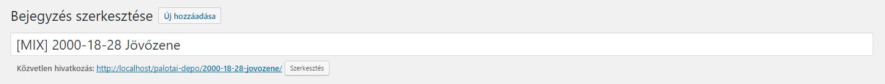

## Bejegyzés közzététel

Címsorban legelső elem a `[TAG]`, ami meghatározza a bejegyzés tartalmát. Ez a `[TAG]` lehet `[MIX]`, `[INTERJÚ]`, `[KEDVENC LEMEZEK]`. Írjuk őket nagybetűvel, szögletes zárójelek közé téve.

A második elem a címsorban a bejegyzés címe. Ha dátumot tartalmaz, akkor az kerül előre, úgy mint: `2000-18-28 Jövőzene`. Legyen szép, figyeljünk a nagy kezdőbetűre.

A közvetlen hivatkozásnál a slug-ból töröljük a `[TAG]`-et, csak a bejegyzés címe jelenjen meg.

**Példa a mixek bejegyzéseihez:**

**Címsor:** `[MIX] 2000-18-28 Jövőzene`

**Közvetlen hivatkozás:** `[...]/palotai-depo/2000-18-28-jovozene/`



---

### Bejegyzés fejléc-szerkezet a mixek számára

#### Felépítés:

**1. A bejegyzés indító**

A bejegyzés címét H3 tag-ek közé tegyük.

```HTML
<h3>Bejegyzes cime</h3>

<hr />

<p class="entry-header-info">
```

---

**2. Tracklist**

+ Ha van tracklist: `a opció`

+ Ha nincs tracklist: `b opció`

a)

``` HTML

<span class="text-highlight hi-lite-title">Tracklist:</span> <span class="text-highlight hi-lite-content hi-lite-yes">van &#10003;</span>

```

b)

``` HTML
<span class="text-highlight hi-lite-title">Tracklist:</span> <span class="text-highlight hi-lite-content hi-lite-no">nincs &#10008;</span>
```

---

**3. Mix.**

+ Ha van mix: `a opció`

+ Ha nincs mix: `b opció`

a) Ha van elérhető mix, akkor írjuk be a **hosszát**, illesszük be a **fájl linkjét**, majd töltsük ki a **mintavételt**, **formátumot** és a **méretét** a fájlnak. A hosszt szimpla 'perc:másodperc' alapon adjuk meg. Mintavétel, formátum és fájlméret a következőképp néz ki: `128kbps MP3 / 118MB`.

``` HTML
<span class="text-highlight hi-lite-title">Mix:</span> <span class="text-highlight hi-lite-content hi-lite-yes">van &#10003;</span>

<span class="text-highlight hi-lite-title">Hossz:</span> <span class="text-highlight hi-lite-content hi-lite-yes">?</span>

<span class="text-highlight hi-lite-title">Letöltés:</span> <a href="" class="letoltes"><span class="text-highlight hi-lite-content hi-lite-yes">?kbps MP3 / ?MB &#8628;</span></a>
```

b) Ha nincs letölthető mix, ne jelenítsük meg feleslegesen a hossz és letöltés sorokat, csak annyit, hogy `nincs`.

``` HTML
<span class="text-highlight hi-lite-title">Mix:</span> <span class="text-highlight hi-lite-content hi-lite-no">nincs &#10008;</span>
```

---

**4. Fejléc záró**

Választóvonal, tovább gomb és tracklist fejléc. Ezután következik maga a tracklist.

``` HTML
<hr />

<!--more-->

<p><span class="text-highlight hi-lite-title">Tracklist:</span></p>
```

---

### Példa-fejléc elérhető tracklist-tel és letölthető mix-szel

#### Szerkezet:

``` HTML
<h3>Jövőzene 2000/03/18</h3>

<hr />

<p class="entry-header-info>
<span class="text-highlight hi-lite-title">Tracklist:</span> <span class="text-highlight hi-lite-content hi-lite-yes">van &#10003;</span>

<span class="text-highlight hi-lite-title">Mix:</span> <span class="text-highlight hi-lite-content hi-lite-yes">van &#10003;</span>

<span class="text-highlight hi-lite-title">Hossz:</span> <span class="text-highlight hi-lite-content hi-lite-yes">103:18</span>

<span class="text-highlight hi-lite-title">Letöltés:</span> <a class="letoltes" href=""><span class="text-highlight hi-lite-content hi-lite-yes">160kbps MP3 / 118MB &#8628;</span></a>

<hr />

<!--more-->

<p><span class="text-highlight hi-lite-title">Tracklist:</span></p>
```

#### Így jelenik meg a tovább kattintás után:

