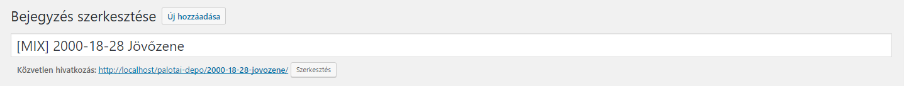

# Bejegyzés közzététel

---



Címsorban legelső elem a `[TAG]`, ami meghatározza a bejegyzés tartalmát. Ez a `[TAG]` lehet `[MIX]`, `[INTERJÚ]`, `[KEDVENC LEMEZEK]`. Írjuk őket nagybetűvel, szögletes zárójelek közé téve. Erre azért van szükség, hogy az oldalsávban megjelenő legutóbbi bejegyzések lista eseményei könnyebben áttekinthetőek legyenek.


A második elem a címsorban a bejegyzés címe. Ha dátumot tartalmaz, akkor az kerül előre, úgy mint: `2000-18-28 Jövőzene`. Legyen szép, figyeljünk a nagy kezdőbetűre.

A közvetlen hivatkozásnál a slug-ból töröljük a `[TAG]`-et, csak a bejegyzés címe jelenjen meg.

**Példa a mixek bejegyzéseihez:**

**Címsor:** `[MIX] 2000-18-28 Jövőzene`

**Közvetlen hivatkozás:** `[...]/palotai-depo/2000-18-28-jovozene/`

## Dátumozás

Minden olyan tartalmnál, ahol tudjuk az eredeti megjelenési dátumot, alkamazzuk azt.
Így lesz konzisztens az archívum, illetve ily módon sorrendben jelenik meg minden
felsorolásban a WordPress-ben.

**Példa:**

A `Jövőzene 2000/09/23` mix bejegyzésnél a következő beállítást alkalmazzuk:


##### Dátumozás intervallum esetén

Amikor olyan tartalomról van szó, ahol egy intervallum van megadva, ott annak az utolsó
napját állítsuk be.

**Példa:**

`Az impulsecreator party-beszámolói 1999.09.18.-2001.05.19.` című bejegyzésnél a 2001. május 19-i
dátumot fogjuk használni.

---

## Bejegyzés fejléc-szerkezet a mixek számára

#### Felépítés:

**1. A bejegyzés indító**

A bejegyzés címét H3 tag-ek közé tegyük.

```HTML
<h3>Bejegyzes cime</h3>

<hr />

<p class="entry-header-info">
```

---

**2. Tracklist**

+ Ha van tracklist: `a opció`

+ Ha nincs tracklist: `b opció`

a)

``` HTML

<span class="text-highlight hi-lite-title">Tracklist:</span> <span class="text-highlight hi-lite-content hi-lite-yes">van &#10003;</span>

```

b)

``` HTML
<span class="text-highlight hi-lite-title">Tracklist:</span> <span class="text-highlight hi-lite-content hi-lite-no">nincs &#10008;</span>
```

---

**3. Mix.**

+ Ha van mix: `a opció`

+ Ha nincs mix: `b opció`

a) Ha van elérhető mix, akkor írjuk be a **hosszát**, illesszük be a **fájl linkjét**, majd töltsük ki a **mintavételt**, **formátumot** és a **méretét** a fájlnak. A hosszt szimpla 'perc:másodperc' alapon adjuk meg. Mintavétel, formátum és fájlméret a következőképp néz ki: `128kbps MP3 / 118MB`.

``` HTML
<span class="text-highlight hi-lite-title">Mix:</span> <span class="text-highlight hi-lite-content hi-lite-yes">van &#10003;</span>

<span class="text-highlight hi-lite-title">Hossz:</span> <span class="text-highlight hi-lite-content hi-lite-yes">?</span>

<span class="text-highlight hi-lite-title">Letöltés:</span> <a href="" class="letoltes"><span class="text-highlight hi-lite-content hi-lite-yes">?kbps MP3 / ?MB &#8628;</span></a>
```

b) Ha nincs letölthető mix, ne jelenítsük meg feleslegesen a hossz és letöltés sorokat, csak annyit, hogy `nincs`.

``` HTML
<span class="text-highlight hi-lite-title">Mix:</span> <span class="text-highlight hi-lite-content hi-lite-no">nincs &#10008;</span>
```

---

**4. Fejléc záró**

Választóvonal, tovább gomb és tracklist fejléc. Ezután következik maga a tracklist.

``` HTML
</p>

<hr />

<!--more-->

<p><span class="text-highlight hi-lite-title">Tracklist:</span></p>
```

---

### Példa-fejléc elérhető tracklist-tel és letölthető mix-szel

#### Szerkezet:

``` HTML
<h3>Jövőzene 2000/03/18</h3>

<hr />

<p class="entry-header-info">
<span class="text-highlight hi-lite-title">Tracklist:</span> <span class="text-highlight hi-lite-content hi-lite-yes">van &#10003;</span>

<span class="text-highlight hi-lite-title">Mix:</span> <span class="text-highlight hi-lite-content hi-lite-yes">van &#10003;</span>

<span class="text-highlight hi-lite-title">Hossz:</span> <span class="text-highlight hi-lite-content hi-lite-yes">103:18</span>

<span class="text-highlight hi-lite-title">Letöltés:</span> <a class="letoltes" href=""><span class="text-highlight hi-lite-content hi-lite-yes">160kbps MP3 / 118MB &#8628;</span></a>
</p>

<hr />

<!--more-->

<p><span class="text-highlight hi-lite-title">Tracklist:</span></p>
```

#### Így jelenik meg a tovább kattintás után:


---

### Tracklist szerkezet

A tracklist következő felépítése elsősorban az esztétikai élmény és az olvashatóság miatt érdekes, de teljesen megfelelő az is, ha csak szimplán beillesztjük a listát a fenti fejléc után.

A tracklist-ben előforduló elemeket, azaz zenéket **általában** maximum 4 részre tudjuk osztani: sorszám, előadó + zene címe, remix (vagy zárójeles) megnevezés (ha van), kiadvány katalógus száma (ha van).

+ A sorszámot tegyük `<span>` tag-be és adjunk neki `text-highlight` class-ot.
``` HTML
<span class="text-highlight">25.</span>
```

+ Előadó + a zene szám címe marad natúr. Jobban olvasható lesz a lista, ha csak a kezdőbetűket írjuk naggyal.
``` HTML
Klute / Phone Call
```

+ A remix vagy zárójeles megnevezést tegyük `<span>` tag-be és kapjon `text-cream` class-t.
``` HTML
<span class="text-cream">(Matrix Remix)</span>
```

+ A kiadvány katalógus száma szintén `<span>`-be kerül és `text-mono` class-t kap.
``` HTML
<span class="text-mono">CERT 18 043</span>
```

#### Példa:

``` HTML
<span class="text-highlight">24.</span> Ram Jam World / Bluesy Baby <span class="text-cream">(Ed Rush & Optical Remix)</span> - <span class="text-mono">F-111</span>

<span class="text-highlight">25.</span> Klute / Phone Call <span class="text-cream">(Matrix Remix)</span> - <span class="text-mono">CERT 18 043</span>

<span class="text-highlight">26.</span> Crackpot / Tippy Tippy Toe - <span class="text-mono">TUCH 042</span>

<span class="text-highlight">27.</span> Dj Food featuring Ken Nordine / The Ageing Young Rebel <span class="text-cream">(Gentle Cruelty)</span> - <span class="text-mono">ZEN LP 049</span>
```

#### Így jelenik meg:


---

### Interjú bejegyzések

Az interjúkat értelemszerűen tartalmi változtatás nélkül közöljük minden esetben, amennyiben lehetséges minden forrással ellátva.

Az interjú szerkezete függ az eredeti interjútól, így ha nincs rá mód, akkor ne változtassunk semmin. Amennyiben van mód némi formázásra, akkor a következő szabályokat próbáljuk alkalmazni.

A legelső sorban a címet `H3` tag-gel írjuk.

Ha van idézet a cikk elején, vagy bárhol az írásban, azt `blockquote` blokkba tegyük.

A rövid, cikk összefoglaló bekezdést tegyük `span` tag-ek közé, és adjunk neki `text-cream` és `text-midsize` class-okat.

Az interjúztató, kérdező, riporter sorait tegyük `span`-ba `text-question` class hozzáadásával a jobb olvashatóság végett.

Palotai válaszai előtt (opcionálisan) megjeleníthető egy `P:`, vagy `P.Zs.:` jelzés `span` tag-ek között `text-pzs` class-szal ellátva. Esetlegesen, a legelső válasznál írjuk ki a teljes nevét.

#### Így jelenik meg:


---

